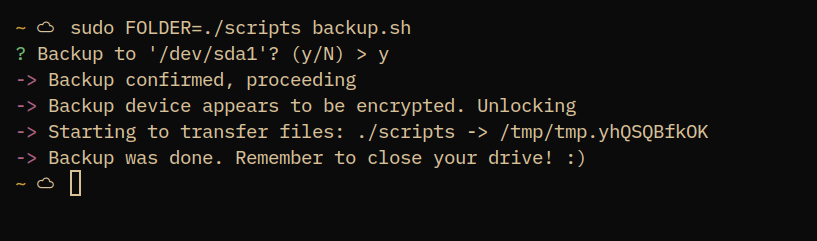
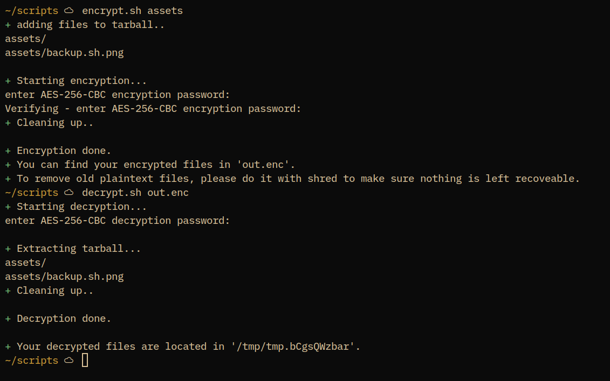

# Scripts

 This repository contains some random scripts that I've created. They are most often motivated by annoyment about doing things constantly again and not having a simple method to do so.  

Most of these are also first thought to be project ideas, but after a while of thinking about it I've come to the conclusion that it's better that they are only implemented as simple shellscripts. 

## Root folder

Repository root folder contains the most important and boring scripts

- ### Somewhat cryptography or privacy related

  - ##### `backup.sh`

    `backup.sh` is my desperate way of backing up my files.

    Basically all it does is decrypts given disk with `cryptsetup`, mounts it to a temporary directory, copies contents of the folder you specify to the disk and then unmounts the directory. 

    

  

  - `encrypt.sh` and `decrypt.sh`

    - `encrypt.sh` creates a new tarball with files and encrypts it with openssl, leaving you with an encrypted tarball

    - `decrypt.sh` decrypts an existing encrypted tarball and extracts it into a temporary folder.

      
      

 

- #### Chromium apps

  - ##### `discord-chromium.sh`

    Completely stolen from https://github.com/turtleb01
    Starts discord as a chromium application so it can't spy on you that much

  - ##### `whatsapp-chromium.sh`

    Improvised from `discord-chromium.sh`.
    Starts https://web.whatsapp.com as a chromium application.

- ####  Other helping hands

  - #### `go-project-init.sh`

    Initialize a new go project

    - Initialize `go.mod`
    - Copy a MIT license from user data directory and replace author per arguments

  - #### `save-battery-mode.sh`

    Closes all unneeded processes (currently just hardcoded, including some of my most expensive applications)

  - #### `lock.sh`

    This script simply locks my desktop. It's in the scripts folder so that I can call it wherever I want and I still get the same login experience.

## `bar/`

`bar/` folder includes some scripts to query specific information from the operating system and show them in my status bar. 
I'll not get into them more, as they are probably only best suitable for my use - the design is a bit rough.
